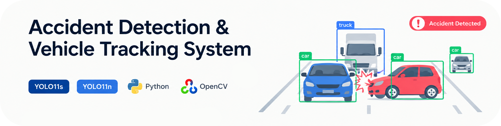
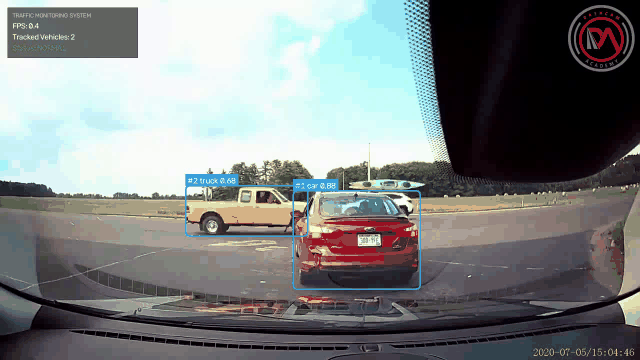
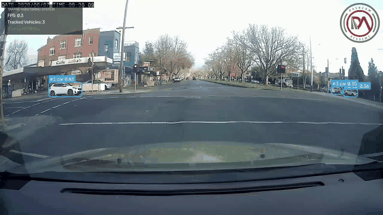
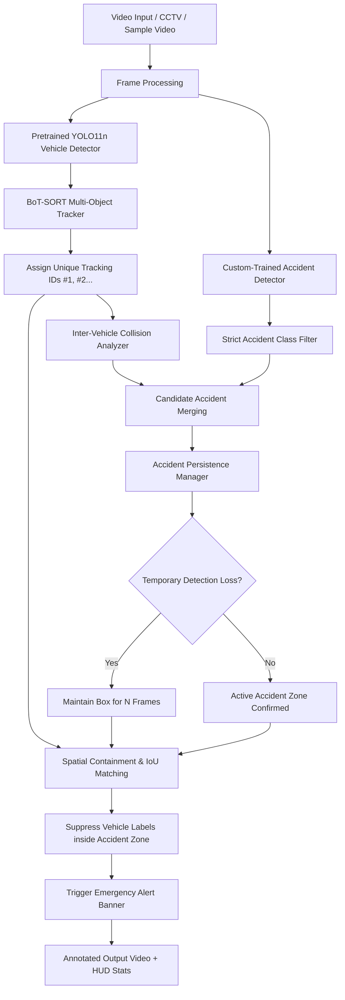

# Accident Detection & Vehicle Tracking System

<div align="center"> 
   
</div>

<br>

[](https://www.python.org/)
[](https://github.com/ultralytics/ultralytics)
[](https://opencv.org/)
[](https://github.com/NirAharon/BoT-SORT)
[](LICENSE)

An intelligent, real-time traffic monitoring and safety system developed using **YOLO11s**, **YOLO11n**, **Python**, and **OpenCV**. The system orchestrates multiple deep learning models, multi-object tracking, and robust spatial logic to reliably detect road accidents and track vehicular traffic.

<p align="center">
  <b>Scenario 1: Vehicle Collision Dynamics & Immediate Alert Trigger</b><br/>
  
</p>

<p align="center">
  <b>Scenario 2: Multi-Vehicle Incident & Traffic Collision Surveillance</b><br/>
  
</p>

---

## Key Highlights

- **Accident Detection (Custom YOLO)**: Detects road accidents and collision zones using a dedicated custom-trained accident detector (`models/accident_yolo11s.pt`).
- **Vehicle Detection (Pretrained YOLO11n)**: Detects cars, motorcycles, buses, and trucks in real-time with lightweight efficiency.
- **Multi-Object Tracking (BoT-SORT)**: Tracks detected vehicles across frames, maintaining consistent, persistent unique IDs.
- **Vehicle Collision Analysis**: Detects physical vehicle collisions via inter-vehicle bounding box overlap and mutual spatial containment.
- **Zero False Positives Before Collision**: Strict class validation ensures normal flowing traffic is never mislabeled as accidents before an actual collision occurs.
- **Spatial Filtering & Region Matching**: Employs confidence filtering, Non-Maximum Suppression (NMS), IoU, and containment-based spatial analysis.
- **Anti-Flicker Persistence Memory**: Maintains accident bounding boxes during temporary detection dropouts caused by smoke, blur, or occlusion.
- **Label Suppression**: Automatically suppresses redundant vehicle bounding boxes inside confirmed accident zones to eliminate visual clutter.
- **Real-Time Emergency Alerts**: Displays an on-screen visual alert banner (`CRITICAL ALERT: ROAD ACCIDENT DETECTED!`) and logs incident details.
- **Annotated Video Production**: Generates clean, production-ready video outputs complete with tracking IDs, bounding boxes, and HUD metrics.
- **Bundled Test Assets**: Pre-configured sample traffic video in `assets/` ready for instant testing out of the box.

---

## System Architecture & Workflow



---

## Repository Structure

The project has been streamlined into an organized, modular, and easy-to-navigate layout:

```text
road-accident-detection/
├── config.yaml          # Master configuration file (models, thresholds, tracker)
├── main.py              # CLI entry point to run inference on videos or webcam
├── requirements.txt     # Python dependencies
├── README.md            # Comprehensive project documentation
├── LICENSE              # MIT License
├── .gitignore           # Ignored temporary files & model checkpoints
│
├── models/              # Model weights directory
│   ├── accident_yolo11s.pt # Custom-trained accident detection weights
│   ├── yolo11n.pt       # Pretrained vehicle detection weights
│   └── README.md        # Instructions for placing model weights
│
├── assets/              # Sample media assets for testing
│   ├── README.md        # Asset specifications & testing instructions
│   ├── demo_1.gif       # Scenario 1 demonstration animation
│   ├── demo_2.gif       # Scenario 2 demonstration animation
│   ├── sample_traffic.mp4   # Sample road accident & traffic video (Scenario 1, 720p HD)
│   └── sample_traffic_2.mp4 # Distinct multi-car incident video (Scenario 2, 720p HD)
│
├── outputs/             # Output directory for generated annotated videos
│   └── .gitkeep
│
├── src/                 # Core modular source code
│   ├── __init__.py      # Clean public package API
│   ├── detector.py      # Dual YOLO model loader (Accident YOLO11s + Vehicle YOLO11n)
│   ├── tracker.py       # BoT-SORT tracking integration with persistent IDs
│   ├── accident_logic.py# IoU, containment calculation, persistence buffer & suppression
│   └── visualizer.py    # OpenCV annotation overlays, alert banners & HUD dashboard
│
└── tests/               # Unit test suite
    ├── __init__.py
    └── test_accident_logic.py # Spatial logic, persistence, and suppression tests
```

---

## Tech Stack

| Technology | Role |
|---|---|
| **Python** | Core application programming language |
| **YOLO11s** | Custom-trained deep learning model for accident/crash detection |
| **YOLO11n** | High-speed pretrained model for multi-class vehicle detection |
| **OpenCV** | Video capture, frame rendering, drawing overlays, and video writing |
| **BoT-SORT** | State-of-the-art multi-object tracker for persistent tracking IDs |
| **PyTorch & Ultralytics** | Model inference, CUDA acceleration, and tensor operations |

---

## Quick Start

### 1. Clone & Set Up Environment

```bash
git clone https://github.com/<your-username>/road-accident-detection.git
cd road-accident-detection

# Create and activate virtual environment (optional but recommended)
python -m venv .venv
# On Windows:
.venv\Scripts\activate
# On Linux/macOS:
source .venv/bin/activate

# Install required dependencies
pip install -r requirements.txt
```

### 2. Model Weights & Zero False-Positive Guard

The repository comes pre-configured with the custom accident model weights:
```text
models/accident_yolo11s.pt
```
- **Custom-Trained Accident Detector**: Specially trained to recognize vehicle collisions, crashes, and road incident zones (`{0: 'Accident'}`).
- **Pretrained Vehicle Detector**: Uses high-speed `yolo11n.pt` for multi-class vehicle detection (`car`, `bus`, `truck`, `motorcycle`, `bicycle`), auto-downloaded on first run.
- **Class Integrity Filter**: The system automatically inspects the loaded model. Even if a generic model is supplied, standard vehicles are **never** mislabeled as accidents before a collision occurs.

### 3. Run Inference

#### Instant Run (Out-of-the-Box Demo):
Simply run `main.py`—if no webcam is connected, it automatically falls back to the bundled sample video:
```bash
python main.py
```

#### Process Sample Traffic Videos:
```bash
# Scenario 1 (Collision Dynamics, ~11.9s):
python main.py --source assets/sample_traffic.mp4 --output outputs/output_scenario1.mp4

# Scenario 2 (Multi-Car Incident Surveillance, ~17.3s):
python main.py --source assets/sample_traffic_2.mp4 --output outputs/output_scenario2.mp4
```

#### Run with Live Preview Display Window:
```bash
python main.py --source assets/sample_traffic.mp4 --show
```

#### Run on Live Webcam (Camera index 0):
```bash
python main.py --source 0 --show
```

#### Specify Custom Weights or Tune Confidence Thresholds:
```bash
python main.py --source assets/sample_traffic.mp4 --conf-accident 0.45 --conf-vehicle 0.35
```

---

## Configuration (`config.yaml`)

All parameters are centrally managed in [`config.yaml`](config.yaml):

```yaml
# Hardware Device ("cuda", "cpu", or "auto")
device: "auto"

models:
  accident:
    weights: "models/accident_yolo11s.pt"
    conf_threshold: 0.40
    iou_threshold: 0.45
  vehicle:
    weights: "models/yolo11n.pt"
    conf_threshold: 0.35
    iou_threshold: 0.50
    classes: [1, 2, 3, 5, 7] # bicycle, car, motorcycle, bus, truck

tracker:
  type: "botsort.yaml"
  max_history: 30

logic:
  containment_threshold: 0.50   # Suppress vehicle label if >=50% inside accident zone
  iou_match_threshold: 0.30     # IoU threshold for matching accident detections
  persistence_frames: 15        # Hold accident box across temporary loss (~0.5s at 30 FPS)
  smoothing_alpha: 0.70         # Bounding box smoothing factor
  suppress_vehicle_labels: true # Hide normal vehicle labels inside accident area

visualization:
  show_tracking_ids: true
  show_confidence: true
  show_alert_banner: true
  show_hud_stats: true
  line_thickness: 2
```

---

## Running Tests

Unit tests verify spatial containment, IoU matching, temporary loss persistence, vehicle label suppression, and inter-vehicle collision detection:

```bash
pytest tests/
```

---

## Community & Feedback

This project helped me explore how multiple object detection models, multi-object tracking, spatial filtering, and video processing can work together in a practical traffic-monitoring scenario.

I’d appreciate your feedback and suggestions on this project as I continue learning and exploring Computer Vision!

`#ComputerVision` `#YOLO11` `#ObjectDetection` `#ObjectTracking` `#BoTSORT` `#Python` `#OpenCV` `#AI` `#MachineLearning` `#TrafficMonitoring` `#AccidentDetection`

---

## 📄 License

This repository is licensed under the **MIT License**. See the [`LICENSE`](LICENSE) file for complete details.

---

## 🔗 Connect with Me

<div align="center">

[](https://mohdfaizy.vercel.app)
[](https://www.linkedin.com/in/mohd-faizy/)
[](https://github.com/mohd-faizy)
[](https://www.credly.com/users/mohd-faizy)
[](https://twitter.com/F4izy)
[](https://ai.stackexchange.com/users/36737/faizy)

</div>